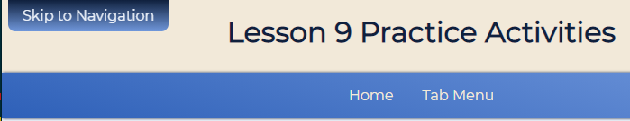

# Skip Navigation Button Activity
In this activity, you will create an accessible feature to help improve the usability of a web page by creating a skip navigation link to allow a screen reader user to jump to the navigation menu.

## Activity Objectives
1. Create a skip navigation link.
2. Apply styling to create the tabbed look.

## HTML Directions
1. Open the `index.html` file.
2. Update the metadata within the `head` element with appropriate information.
3. Update the paragraph elements within the `footer` element with your information.
4. Save and apply a commit to the file.

### Create Skip Link
1. Add a `main-nav` `id` to the `nav` element. *This will be used to create a bookmark link.*
2. After the opening `body` tag and before any other elements, create a link.
   1. Make the link point to the `id` you applied to the `nav` element.
   2. Add an `id` to the link of `skip-nav`.
3. Save and apply a commit to the file.

## Styling the Tab Component
Use any appropriate selectors and property-value pairs to style the web pages and elements. Keep in mind the cascade, specificity, and inheritance as you apply properties to the various elements.

Add the styles after the `Skip Navigation styles - start` comment.

1. Style the `skip-nav` element as follows:
   1. Position the element absolutely.
   2. Set the left property to `.5rem`.
   3. Add a top and bottom padding of `.5rem` and a left and right padding of `1rem`.
   4. Apply the `main-color-800` as the background color.
   5. Apply the `accent-color-100` as the text color.
   6. Set the text decorations to none to remove the underline.
   7. Add a border radius of `.5rem` to the bottom left and bottom right corners, leaving the top corners square.
   8. Set the transform origin to be along the top.
   9. Apply a rotation transformation in the X axis of `90deg`.
   10. Define the transition duration to be `200ms` and allow `all` properties to transform.
2. Create a focus state for the `skip-nav` link as follows:
   1. Add a linear gradient that goes to the bottom using the main color `800` and `400`.
   2. Set the text color to use the main color `100`.
   3. Rotate the element in the X axis to 0.
   4. Remove the outline.
3. Save and apply a commit to the file.

The following image is an example of what the skip navigation will look like when you focus on it using the `TAB` key on the keyboard.

## Conclusion
When you are done with the activity:
1. Be sure you check for any validation, spelling, and grammar errors and correct them.
2. Publish your website to GitHub pages.
3. Sync the files (i.e., push your changes) with the remote repo on GitHub.