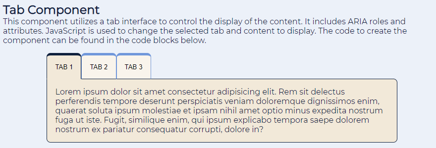
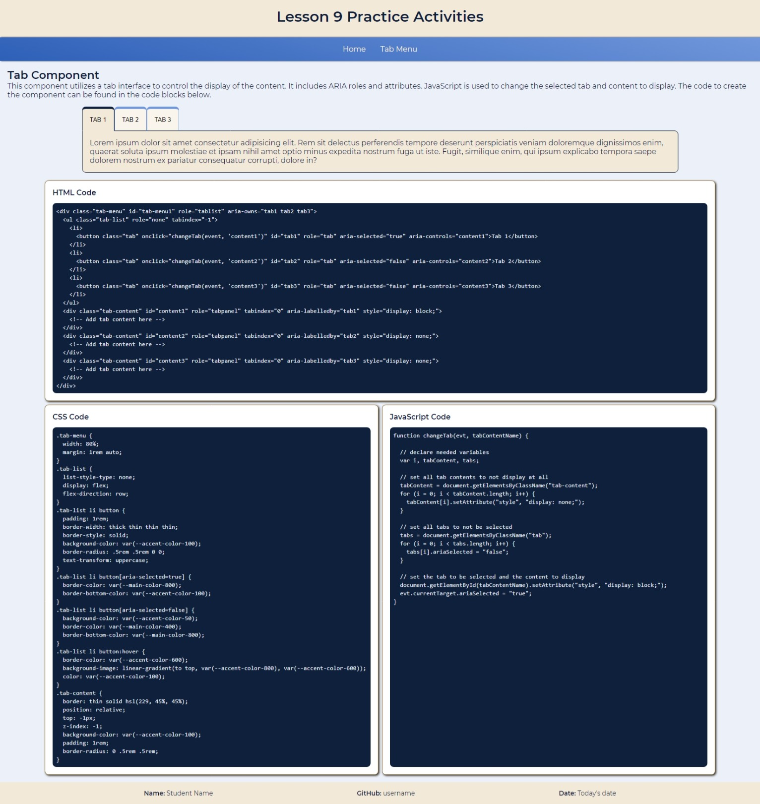

# Tab Menu with ARIA Activity
In this activity, you will create an tabbed interface and apply principles of ARIA to the various elements to help improve the accessibility of the component.

## Activity Objectives
1. Create a tab menu.
2. Create content blocks to display for each tab.
3. Apply styling to create the tabbed look.
4. Apply ARIA to the elements.
5. Connect to the JavaScript to get the interface to work as desired.

## HTML Directions
1. Open the `index.html` file.
2. Update the metadata within the `head` element with appropriate information.
3. Update the paragraph elements within the `footer` element with your information.
4. Save and apply a commit to the file.

### Create Tab Component
1. Create a copy of the `index.html` file and save it with the name of `tab-component.html` to the root of the repo (i.e., where the index.html file is located).
2. Remove the `dl` for the list of activities.
3. Modify the second level heading within the `content` section element to read: `Tab Component`.
4. Add a paragraph after the second level heading with the following text: `This component utilizes a tab interface to control the display of the content. It includes ARIA roles and attributes. JavaScript is used to change the selected tab and content to display. The code to create the component can be found in the code blocks below.`
5. Create a `div` element with a class of `tab-menu`.
6. Create another `div` element with a class of `code`.
7. Save and apply a commit to the file.
8. Within the `tab-menu` element:
   1. Create an unordered list with a class of `tab-list` and a `tabindex` of `-1`.
   2. Create 3 list items with a button element in each list item.
   3. Apply a class of `tab` to each button.
   4. Add text to each button so the button reads as follows, respectively: `Tab 1`, `Tab 2`, `Tab 3`
   5. Add an id to each button as follows, respectively: `tab1`, `tab2`, `tab3`
   6. After the ordered list, create 3 `div` elements with a class of `tab-content` and a `tabindex` of `0`.
   7. Add an id to each `tab-content` element as follows, respectively: `content1`, `content2`, `content3`.
   8. Within each `tab-content` element add some paragraph elements with lorem ipsum placeholder text.
9. Save and apply a commit to the file.
10. Within the `code-examples` div element:
    1.  Create 3 figure elements with a class of `code-block`.
    2.  Add an id to each figure as follows, respectively: `html`, `css`, `javascript`.
    3.  Add a figure caption to each figure with the following text, respectively: `HTML Code`, `CSS Code`, `JavaScript Code`
    4.  After each caption, create a `pre` element.
    5.  Within the `pre` element create a `code` element.
11. Save and apply a commit to the file.

### Add ARIA Roles to the Elements
1. Add a role of `tablist` to the `tab-menu` element.
2. Add a role of `none` to the unordered list.
3. Add a role of `tab` to each button element.
4. Add a role of `tabpanel` to each `tab-content` element.
5. Save and apply a commit to the file.

### Create Relationships between the Elements with ARIA
1. Define the ownership of the button elements by:
   1. Adding an `aria-owns` attribute to the `tablist` element.
   2. Add a value to the attribute that is a space separated list of the ids of the 3 buttons. e.g., `aria-owns="id1 id2 id3"` replace `id1` with the actual id for the first button, etc.
2. Identify what elements are controlled by each button by:
   1. Applying an `aria-controls` attribute to each button.
   2. Add a value that matches the id of the `tab-content` elements, respectively. i.e., The Tab 1 button would control the first content element, the Tab 2 button would control the second content element, etc.
3. Identify what the tabpanel content is labeled with by:
   1. Applying an `aria-labelledby` attribute to each of the `tab-content` elements.
   2. Add a value that is the corresponding id of the button that controls it. i.e., the first content element is labelled by the first button, etc.
4. Save and apply a commit to the file.

### Identify the Selected Tab with ARIA
1. On each button, add an `aria-selected` attribute.
2. Set all the attributes to `false`, except for the first one, which should be set to `true`.
3. Save and apply a commit to the file.

### Triggering the JavaScript on Button Clicks
On the button elements within the unordered list:
1. Add an `onclick` attribute to each button.
2. Set the value of the attributes to follow this pattern: `changeTab(event, '{Tab panel ID}')`
   1. Where `{Tab panel ID}` is the `id` attribute value you assigned to the panel that should be displayed when that button is clicked. 
   2. For example, the first button's `onclick` attribute would be `changeTab(event, 'content1')`.

## Styling the Tab Component
Use any appropriate selectors and property-value pairs to style the web pages and elements. Keep in mind the cascade, specificity, and inheritance as you apply properties to the various elements.

Add the styles after the `Tab Component styles - start` comment.

1. Style the `tab-menu` element as follows:
   1. Apply a width of `80%`.
   2. Set the top and bottom margins to `1rem` and the left and right to `auto` to center it within its parent element.
2. Style the `tab-list` element as follows:
   1. Remove the bullet markers from the list style.
   2. Convert it to a flex container.
   3. Set the flex direction to row.
3. Style the buttons within the list items as follows:
   1. Add a padding of `1rem` to all sides.
   2. Use the `accent-color-100` for the background color.
   3. Add a thin border with to all sides, except the top which should be thick.
   4. Define the border style to be solid
   5. Add a border radius of `.5rem` to the upper left and upper right corners. The bottom corners should remain square.
   6. Apply an uppercase `text-transform`.
4. Style the button within the list item that has the `aria-selected` attribute set to `true` as follows:
   1. Set the border color to use the `main-color-800`, except for the bottom border color which should use the same color as the background color of the button. *This will help give the visual impression that the tab is a part of the content.*
5. Style the button within the list item that has the `aria-selected` attribute set to `false` as follows:
   1. Set the background color to use the `accent-color-50`.
   2. Set the border color to use `main-color-400`. *This and the background color will help give the visual impression that the tab is farther back since it is a bit muted.*
   3. Set the bottom border color to `main-color-800`.
6. Create a hover link state for the button and style it as follows:
   1. Apply the `accent-color-600` as the border color.
   2. Create a linear gradient for the background that goes to the top, uses the `accent-color-800`, and `accent-color-600` colors.
   3. Set the text color to use the `accent-color-100`.
7. Style the `tab-content` as follows:
   1. Apply a thin solid border using the `main-color-800` as the border color.
   2. Apply a relative position.
   3. Set the top property to `1px`. *This is needed to move the content up the width of the tab bottom border to it looks right.*
   4. Set the `z-index` to `-1`. *This will make sure that the content appears below the tabs to help create the effect the tab is attached to the content.*
   5. Set the background color to use the `accent-color-100`.
   6. Add a padding to all sides of `1rem`.
   7. Add a border radius to all corners, except the top left, of `.5rem`.
8. Save and apply a commit to the file.
9. Within the HTML file:
   1. Add an inline style attribute to the tab panel elements. *This is needed to hide the content for all tabs other than the one that should be displayed. The JavaScript will update this attribute value as needed when the buttons are clicked.*
   2. Set the first tab panel that is linked to the Tab 1 button to `display: block;`.
   3. Set the other tab panels to `display: none;`.
10. Save and apply a commit to the file.

At this point, your tab component should look like the following:

### Style the Code Blocks
Use any appropriate selectors and property-value pairs to style the web pages and elements. Keep in mind the cascade, specificity, and inheritance as you apply properties to the various elements.

Add the styles after the `Code Block styles - start` comment.

1. Style the `code-examples` div element as follows:
   1. Set the width to be 90%.
   2. Set the margins to auto to center it on the page.
   3. Convert the element to a grid container.
   4. Define the grid template columns to repeat 2 times with a width of `1fr`.
   5. Add a gap of `.5rem`.
2. Style the `code-block` elements as follows:
   1. Apply a thin solid border using the `accent-color-600` color.
   2. Apply a padding to all sides of `1rem`.
   3. Set the background color to white.
   4. Apply a border radius to all corners of `.5rem`.
   5. Add a box shadow.
   6. Convert the element to a grid container.
   7. Define the row templates to have `2rem` and `1fr`.
3. Style the pre element within the `code-block` elements as follows:
   1. Apply the `font-code` to the font family.
   2. Apply the `main-color-800` as the background color.
   3. Use the `main-color-100` as the text color.
   4. Add a padding to all sides of `.5rem`.
   5. Add a border radius to all corners of `.5rem`.
   6. Set the `white-space` property to `pre-wrap`.
   7. Set the `word-break` property to `break-all`. *These last two properties help to wrap the text if the line of code extends outside of the container.*
4. Style the figure caption element within the `code-block` elements as follows:
   1. Apply a bold font weight.
   2. Generate whitespace by adding a bottom padding of `.5rem`.
5. Style the HTML code block element as follows:
   1. Place the element in grid row 1.
   2. Place the element to span 2 grid columns.
6. Style the CSS code block element as follows:
   1. Place the element in grid row 2.
   2. Place the element in column 1.
7. Style the JavaScript code block element as follows:
   1. Place the element in grid row 2.
   2. Place the element in column 2.
8. Save and apply a commit to the file.

## Add Code Examples to the HTML file

1. Open the `tab-menu.js` script.
2. Copy the code starting from line 3 to the end.
3. Paste the code into the `code` element for the `javascript` figure element.
4. Open the `style.css` file.
5. Copy the CSS code between the start and end comments for the tab component styles.
6. Paste the code into the `code` element for the `css` figure element.
7. Copy the `tab-menu` div element, and its children.
8. Paste the code into the `code` element for the `html` figure element.
   1. Replace the paragraph elements with an HTML comment to `Add tab content here`.
9.  Be sure to escape any special characters within each of the code elements. e.g., changing the `<` character to `&lt;`. 

> NOTE: You may need to move the indent of the pasted code to the left so it appears correct within the HTML page.

The following image is an example of what the page should look like after adding the styling and content to the page.

## Conclusion
When you are done with the activity:
1. Be sure you check for any validation, spelling, and grammar errors and correct them.
2. Sync the files (i.e., push your changes) with the remote repo on GitHub.
